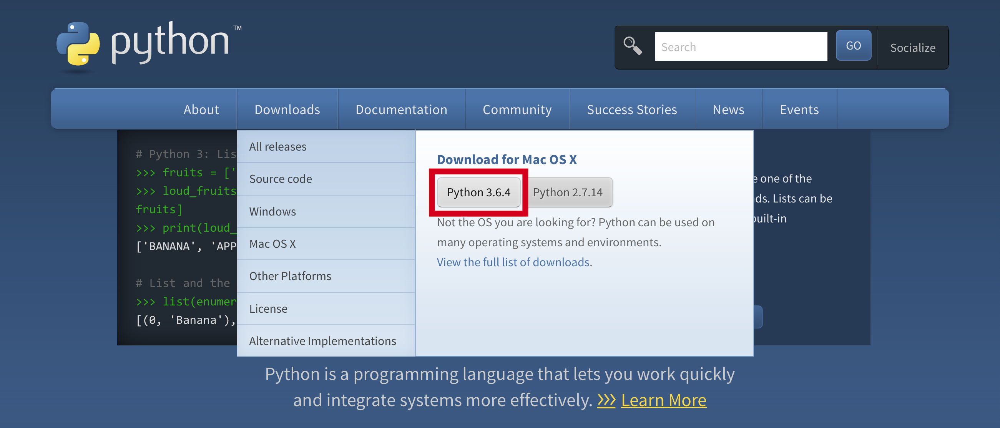
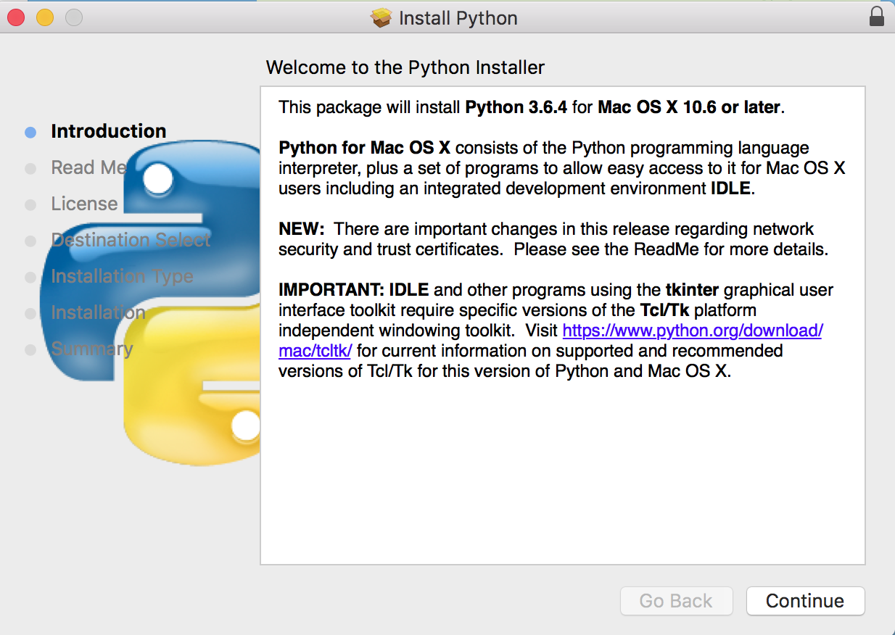

# Mac Python Installation Guide

1. Go to https://www.python.org
2. Click on downloads, and select "Python 3.6.4"


3. Go through the installation instructions



4. Restart Terminal
```
$ python3 --version

# Make sure the output should be 3.6.*

$ pip3 --version

# Make sure the output should be pip 9.0.*
```
5. Install PyGame
```
python3 -m pip install pygame
```
