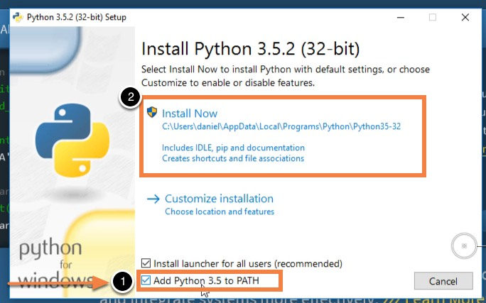

# Window Python Installation Guide

1. Downlaod the latest [Python 3.6.4](https://www.python.org/ftp/python/3.6.4/python-3.6.4.exe) from the official website.

	**Remember to check the `Add Python to path` option as shown below**

	

2. Open terminal and make sure you had successfully install Python and had been added to path

	```
	> python3 --version

	# Make sure the output should be 3.6.*
	```

	*If the python3 did not successfully added to path, look at [how to find your python directory](http://docs.python-guide.org/en/latest/starting/install3/win/) and [how to set path](https://superuser.com/a/949577/747852). (For setting path, old method are much more easier as you can use GUI)*

3. Install PyGame

	```
	> python3 -m pip install pygame

	```

*For more information, you can facebook message us or email to 15033996@imail.sunway.edu.my*
